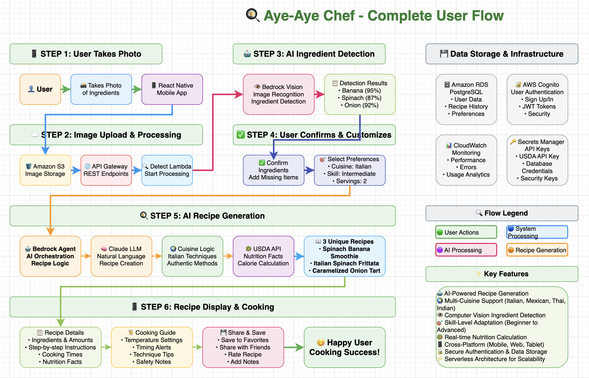

# 🍳 Aye-Aye Chef - AI Recipe Generation System

**Transform your ingredients into delicious recipes with the power of AI!**

Aye-Aye Chef is an intelligent recipe generation system that uses computer vision and AI to detect ingredients from photos and create personalized, cuisine-specific recipes tailored to your preferences.

## 🌐 **Try It Live**

**🔗 [https://aye-aye-chef.netlify.app](https://aye-aye-chef.netlify.app)**

*Works on any device - mobile, tablet, or desktop!*

---

## 🎯 **What is Aye-Aye Chef?**

Aye-Aye Chef is an AI-powered cooking companion that:

- 📸 **Scans ingredients** from photos using computer vision
- 🤖 **Generates personalized recipes** using AWS Bedrock AI
- 🌍 **Adapts to cuisines** (Italian, Mexican, Thai, Indian, Mediterranean, etc.)
- 🍌 **Smart ingredient detection** (fruits → smoothies/desserts, vegetables → cuisine recipes)
- 👨‍🍳 **Skill-level adaptation** (beginner, intermediate, advanced)
- 🥗 **Nutrition information** with USDA database integration
- 📱 **Cross-platform** - works everywhere

---

## 🚀 **How to Use Aye-Aye Chef**

### **Step 1: Access the App**
Visit **[https://aye-aye-chef.netlify.app](https://aye-aye-chef.netlify.app)** on any device

### **Step 2: Sign Up/Sign In**
- Create a free account or sign in
- Secure authentication powered by AWS Cognito

### **Step 3: Scan Your Ingredients**
- 📷 **Take a photo** of your ingredients, or
- 🖼️ **Upload from gallery**
- 🔄 **Process image** - AI detects ingredients automatically

### **Step 4: Confirm & Customize**
- ✅ **Confirm detected ingredients**
- ➕ **Add missing ingredients** manually
- 🍽️ **Select meal type** (breakfast, lunch, dinner)
- 🌶️ **Choose cuisine** or recipe type
- 👨‍🍳 **Set skill level** (beginner/intermediate/advanced)
- 🥗 **Add dietary restrictions** (vegan, gluten-free, etc.)

### **Step 5: Get Your Recipes**
- 🤖 **AI generates 3 unique recipes** based on your preferences
- 📋 **Detailed instructions** with step-by-step cooking guide
- ⏱️ **Cooking times** and difficulty levels
- 🥄 **Ingredient measurements** and substitutions
- 📊 **Nutrition facts** per serving

### **Step 6: Cook & Enjoy!**
- 👨‍🍳 Follow the detailed cooking instructions
- 🔄 **Share recipes** with friends and family
- 📱 Access your recipes anytime, anywhere

---

## ✨ **Key Features**

### 🧠 **AI-Powered Intelligence**
- **AWS Bedrock Agent** for recipe orchestration
- **Claude LLM** for natural language recipe generation
- **Computer Vision** for accurate ingredient detection
- **Dynamic recipe variety** - never get the same recipe twice

### 🌍 **Cuisine Expertise**
- **Italian**: Authentic pasta, risotto, and regional specialties
- **Mexican**: Traditional tacos, salsas, and regional dishes
- **Thai**: Balanced sweet-sour-salty-spicy flavors
- **Indian**: Spice-layered curries and regional cuisines
- **Mediterranean**: Fresh, herb-forward, olive oil-based dishes
- **American**: Classic comfort foods and modern fusion

### 🍓 **Smart Ingredient Logic**
- **Fruits detected** → Smoothie and dessert recipes
- **Vegetables detected** → Cuisine-specific cooking recipes
- **Protein detected** → Complete meal suggestions
- **Mixed ingredients** → Creative combination recipes

### 👨‍🍳 **Skill-Level Adaptation**
- **Beginner**: Detailed step-by-step with explanations
- **Intermediate**: Standard techniques with tips
- **Advanced**: Professional methods and techniques

### 🥗 **Nutrition Integration**
- **USDA FoodData API** for accurate nutrition facts
- **Per-serving calculations** based on portion sizes
- **Macro and micronutrient** breakdown
- **Dietary restriction** compliance

---

## 🏗️ **Architecture**

### **Complete User Flow**



*Complete user flow from photo capture to recipe generation, showing all steps, AWS services, and AI components working together.*

### **System Architecture**


*Technical architecture diagram showing the serverless infrastructure and AI processing pipeline.*

Aye-Aye Chef is built on a modern, scalable architecture:

### **Frontend**
- **React Native** for cross-platform mobile app
- **Expo** for web deployment
- **Responsive design** works on all devices

### **Backend (AWS)**
- **API Gateway** for REST API endpoints
- **Lambda Functions** for serverless processing
- **S3** for image storage
- **RDS PostgreSQL** for data persistence
- **Cognito** for user authentication
- **Bedrock** for AI recipe generation
- **CloudWatch** for monitoring

### **AI Services**
- **Amazon Bedrock Agent** for AI orchestration
- **Claude LLM** for recipe reasoning
- **Bedrock Vision** for ingredient recognition
- **USDA API** for nutrition data

---

## 🛠️ **For Developers**

### **Development Environment**
This project was developed using **[Kiro IDE](https://kiro.ai)** - an AI-powered development environment that significantly accelerated the development process through intelligent code generation, automated testing, and seamless AWS integration.

### **Local Development**
```bash
# Clone the repository
git clone https://github.com/aditya2812/aye-aye-chef.git
cd aye-aye-chef

# Install dependencies
npm install
cd mobile-app
npm install

# Start development server
npm run web
```

### **Deploy Your Own**
```bash
# Build for production
npm run build:web

# Deploy to Netlify
npm run deploy:netlify
```

### **AWS Infrastructure**
```bash
# Deploy backend infrastructure
npm run deploy
```

### **Repository Structure**
```
aye-aye-chef/
├── 📱 mobile-app/          # React Native/Expo frontend
├── ⚡ lambda/              # AWS Lambda functions
├── 🏗️ lib/                # AWS CDK infrastructure
├── 📚 docs/               # Documentation
├── 🧪 tests/              # Test suite
└── 🔧 scripts/            # Deployment scripts
```

---

## 📱 **Supported Platforms**

- ✅ **Web Browsers** (Chrome, Safari, Firefox, Edge)
- ✅ **Mobile Web** (iOS Safari, Android Chrome)
- ✅ **Desktop** (Windows, macOS, Linux)
- ✅ **Tablets** (iPad, Android tablets)

---

## 🔒 **Privacy & Security**

- 🔐 **Secure authentication** with AWS Cognito
- 🛡️ **HTTPS encryption** for all data transmission
- 🗄️ **Secure data storage** in AWS infrastructure
- 🚫 **No data selling** - your recipes are yours
- 🔄 **GDPR compliant** data handling

---

## 🎯 **Use Cases**

### **Home Cooks**
- Turn leftover ingredients into meals
- Discover new recipes for familiar ingredients
- Learn cooking techniques for your skill level

### **Meal Planning**
- Plan meals based on available ingredients
- Get nutrition information for healthy eating
- Adapt recipes for dietary restrictions

### **Culinary Exploration**
- Explore international cuisines
- Learn authentic cooking techniques
- Discover ingredient combinations

### **Food Waste Reduction**
- Use up ingredients before they expire
- Creative recipes for unusual combinations
- Maximize ingredient utilization

---

---

## 🎉 **Try It Now!**

**Ready to transform your cooking?**

**👉 [Launch Aye-Aye Chef](https://aye-aye-chef.netlify.app) 👈**

*Start creating amazing recipes from your ingredients in seconds!*

---

<div align="center">

**Made with ❤️ and 🤖 AI using [Kiro IDE](https://kiro.ai)**

*Aye-Aye Chef - Where Ingredients Meet Intelligence*

</div>